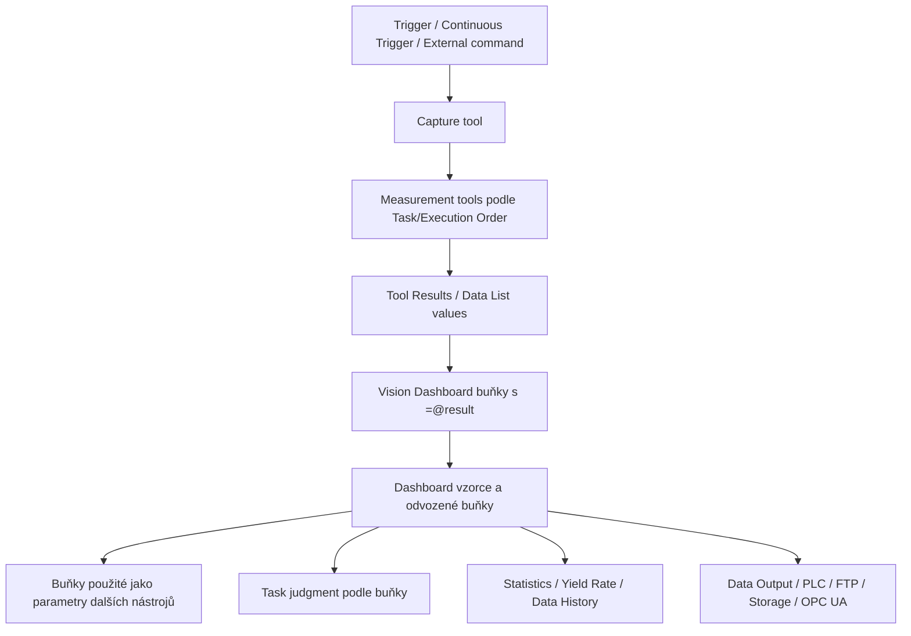

# VS Creator – Vision Dashboard  
## Principy použití, vazby na nástroje, vzorce, zobrazení a časový běh výpočtů

Tento dokument je připravený jako **vysvětlující technický vzor pro agenta CODEX**.  
Je psaný tak, aby se z něj daly odvodit pravidla pro analýzu, generování a kontrolu konfigurací ve **VS Creatoru** pro kamery **Keyence VS Series**.

Dokument vychází hlavně z lokálně dostupných manuálů:

- `AS_160779_VS_UM_J18GB_WW_GB_2085_8.pdf` – **VS Series User's Manual**, zejména Chapter 8 *Vision Dashboard*, Chapter 5 *Data Analysis*, Chapter 6 *Task*, Chapter 11 *Properties*, Chapter 13 *Control/Data Output*.
- `AS_139073_VS_SG_I84GB_WW_GB_2123_1.pdf` – **VS Series Easy Configuration Manual PROFINET Edition**, zejména příklady zápisu do buněk Vision Dashboardu přes PLC.
- `AS_136230_VS_SG_G90GB_WW_GB_2093_1.pdf` – **VS Series Setup Manual**, zejména připojení, režimy, spuštění VS Creatoru.
- `vs_creator_optimized.jsonl` a `output_vs_help.zip` – strojově zpracované texty nápovědy k VS Creatoru.

Veřejné zdroje Keyence:

- VS Series User Support: <https://www.keyence.com/support/user/vision/vs/>
- VS Series Manuals: <https://www.keyence.com/support/user/vision/vs/manual/>
- VS Series Software / VS Creator: <https://www.keyence.com/support/user/vision/vs/software/>
- VS Series product page: <https://www.keyence.com/products/vision/vision-sys/vs/>
- VS Series setup videos: <https://www.keyence.com/support/user/vision/vs/video/>

> Poznámka: některé dokumenty nebo instalační soubory mohou vyžadovat registraci/přihlášení na stránkách Keyence.

---

# 1. Krátké shrnutí

**Vision Dashboard** je tabulkový pracovní prostor uvnitř VS Creatoru. Vypadá a chová se podobně jako spreadsheet, ale je integrovaný přímo do inspekčního programu kamery VS.

Slouží k:

1. **monitoringu výsledků** z nástrojů,
2. **výpočtům nad výsledky** pomocí vzorců,
3. **vizualizaci** pomocí tabulek, grafů, podmíněného formátování, obrázků, odkazů a poznámek,
4. **řízení parametrů nástrojů** přes hodnoty buněk,
5. **operátorskému vstupu** přes editovatelné konstantní buňky nebo tlačítka,
6. **přenosu dat** mezi nástroji, PLC, příkazovým rozhraním, statistikou, historií a výstupními nástroji.

Klíčový princip:

```text
Tool result  ->  Vision Dashboard cell  ->  Formula / status / chart
Vision Dashboard cell  ->  Tool setting parameter
PLC / command / button  ->  Vision Dashboard cell or command action
Vision Dashboard cell or result item  ->  Statistics / Yield Rate / Data History
```

Vision Dashboard tedy není jen „tabulka pro zobrazení“. Je to **datový a logický uzel** uvnitř VS programu, který může být zároveň:

- cílem výsledků měření,
- zdrojem parametrů nástrojů,
- zdrojem rozhodnutí pro task,
- pomocným UI pro obsluhu,
- diagnostickým watch window,
- zdrojem dat pro výstupy do PLC nebo souborů.

---

# 2. Mentální model pro CODEX agenta

Pro potřeby agenta je vhodné modelovat Vision Dashboard jako objekt:

```text
VisionDashboard
  ├─ cells[1..1000][1..100]
  │   ├─ constant: number | string | boolean | error | empty
  │   ├─ formula: expression starting with "="
  │   ├─ format: number format, font, fill, border, alignment
  │   ├─ validation: allowed input type / limits / list
  │   ├─ conditional_format_rules
  │   ├─ memo
  │   └─ link metadata
  ├─ objects
  │   ├─ images
  │   ├─ buttons
  │   ├─ links
  │   └─ charts
  ├─ references
  │   ├─ result_data -> cell
  │   ├─ cell -> tool_setting_parameter
  │   ├─ cell -> cell
  │   ├─ cell -> task_judgment
  │   ├─ cell -> statistics/yield/history target
  │   └─ external_command -> cell
  └─ protection / permission / mode state
```

Pro CODEX je zásadní rozlišovat **směr vazby**:

| Směr vazby | Význam | Typická implementace |
|---|---|---|
| `ToolResult -> Cell` | buňka čte aktuální výsledek nástroje | vzorec `=@...`, drag & drop z Data List / Results |
| `Cell -> ToolParameter` | parametr nástroje čte hodnotu buňky | Reference dialog v Properties, případně drag & drop |
| `Cell -> Cell` | interní spreadsheet výpočet | běžný vzorec typu `=A1+B1` |
| `Cell -> Task judgment` | výsledek buňky rozhoduje o Pass/Fail tasku | nastavení judgment targetu v Task |
| `PLC/Command -> Cell` | PLC zapíše číslo/text/logickou hodnotu | příkazy CWN/CWS/CWB |
| `Cell -> Data Output` | hodnota buňky se odešle do PLC/souboru/FTP/OPC UA | Data Output nástroje |
| `Cell -> Statistics/Yield/Data History` | buňka je sledovaná datovým analytickým nástrojem | cílový item v příslušném toolu |
| `Button -> Command/Event/Task` | Dashboard tlačítko vyvolá akci | vložený Button objekt |

Doporučení pro agenta:

- Nikdy nepovažovat Dashboard jen za pasivní UI.
- Při analýze programu vždy hledat, zda buňky neřídí parametry nástrojů.
- U každé vazby určit, kdo je **source** a kdo je **consumer**.
- U výpočtů, které ovlivňují nástroje, kontrolovat **pořadí vykonání**.
- U buněk editovatelných obsluhou odlišit konstantu od vzorce.
- U chráněných dashboardů počítat s tím, že vzorce nemusí být uživatelsky viditelné.

---

# 3. Základní funkce Vision Dashboardu

## 3.1 Spreadsheet část

Vision Dashboard má buňky jako běžný spreadsheet. Podporuje:

- zadávání čísel a textů,
- vzorce začínající znakem `=`,
- formát čísla a textu,
- font, zarovnání, barvu, výplň, okraje,
- podmíněné formátování,
- validaci vstupu,
- hledání a nahrazení vzorců nebo hodnot,
- Auto Fill,
- zobrazení/skrytí gridlines,
- zobrazení vzorce místo vypočtené hodnoty,
- zobrazení vazeb šipkami přes **Show Links**.

Limit vstupu podle manuálu: **1000 řádků × 100 sloupců**.

Praktický dopad:

- Dashboard lze použít jako malý výpočetní list.
- Není určen jako náhrada rozsáhlé databáze.
- Při velkém množství buněk, složitých vzorcích nebo grafů je nutné sledovat výkon a systémové chyby.

## 3.2 Integrační část

Vision Dashboard umí být propojený s ostatními pohledy:

- **Data List** – zdroj výsledků a parametrů.
- **Results / Tool Results** – zdroj aktuálních měřených hodnot.
- **Properties** – místo, kde lze parametry nástrojů navázat na buňky.
- **Task** – task může používat buňku jako judgment target.
- **Data Analysis tools** – Statistics, Yield Rate, Data History mohou cílit na výsledky nebo buňky.
- **Control/Data Output** – buňky mohou být čteny/zapisovány přes příkazy nebo používány ve výstupu.

## 3.3 UI část

Do dashboardu lze vkládat:

- obrázky,
- tlačítka,
- interní nebo externí odkazy,
- grafy,
- poznámky/memos,
- opakovaně použitelné šablony.

Tlačítko může spouštět proces, například:

- editaci regionu,
- vykonání tasku,
- soft event,
- příkaz.

---

# 4. Vstupní a výstupní datové vazby

## 4.1 Výsledek nástroje do buňky

Nejčastější vazba je:

```text
Tool result / label result -> Vision Dashboard cell
```

Postup:

1. Otevřít Data List, Results nebo Tool Results.
2. Vybrat výsledek nástroje.
3. Přetáhnout ho do Vision Dashboardu.
4. VS Creator vloží název a hodnotu do buněk vedle sebe.
5. Buňka s hodnotou obsahuje vzorec odkazující na výsledek.

Přímý zápis ve vzorci má tvar:

```spreadsheet
=@Tool[0002].Output.General.Pass
```

Obecně:

```spreadsheet
=@<tool_name_or_id>.<result_path>[optional_index]
```

V manuálu je popsáno, že výraz pro `<result data>` začíná názvem nástroje a názvem položky oddělenými tečkou a případným label indexem v hranatých závorkách.

### Příklad

```spreadsheet
A1 = "Area Pass"
B1 = @Tool[0002].Output.General.Pass

A2 = "Area px"
B2 = @Tool[0002].Output.Measurement.Area
```

Praktická poznámka:

- Název výsledku a přesná cesta závisí na konkrétním typu toolu.
- Vždy je bezpečnější vytvořit referenci drag & dropem a pak si přečíst vzniklý vzorec.
- U label výsledků je důležité hlídat index labelu.

## 4.2 Buňka do parametru nástroje

Druhý zásadní směr:

```text
Vision Dashboard cell -> Tool setting parameter
```

Použití:

- limit měření řízený z buňky,
- prahová hodnota řízená obsluhou,
- výběr režimu nebo tolerance z dashboardu,
- výsledek výpočtu v dashboardu použitý jako parametr dalšího nástroje.

Postup přes Properties:

1. Otevřít **Properties** daného nástroje.
2. Najít parametr, který dovoluje referenci.
3. U textového/numerického pole kliknout na ikonu vazby/linku.
4. V dialogu vybrat záložku **Vision Dashboard**.
5. Kliknout na buňku.
6. Potvrdit.

Po navázání se textové pole parametru zobrazí světle modře.

### Chování konstantní buňky

Pokud parametr odkazuje na konstantní číselnou buňku:

```text
změna buňky -> změní parametr
změna parametru -> změní buňku
```

Tento stav je vhodný pro operátorsky nastavitelné tolerance.

### Chování buňky se vzorcem

Pokud parametr odkazuje na buňku se vzorcem:

```text
výsledek vzorce -> parametr nástroje
parametr nelze přímo měnit, protože je řízen výpočtem
```

V Properties se taková hodnota zobrazuje šedě a nelze ji přepsat.

### Typová kompatibilita

Pokud datový typ neodpovídá parametru, vznikne setting error. Typicky:

- parametr očekává číslo, ale buňka obsahuje text,
- parametr očekává boolean, ale buňka obsahuje neplatný řetězec,
- buňka vrací error value.

Doporučení pro CODEX:

```text
Při generování návrhu vazby cell -> parameter vždy validuj typ:
number -> numeric parameter
boolean -> logical parameter
string -> string/list parameter
```

---

# 5. Reference a Show Links

Vision Dashboard umí zobrazovat vztahy mezi:

- buňkami navzájem,
- buňkou a result data položkou,
- buňkou a setting parameterem.

Show Links vykresluje šipky:

- kořen šipky je referencovaná strana,
- hrot šipky je referencující strana.

Dependency level lze zvyšovat až na úroveň 10. To je důležité pro diagnostiku řetězců:

```text
ToolResult -> Cell A1 -> Formula B1 -> ToolParameter -> další výsledek
```

Doporučení pro agenta:

- Při hledání „proč se změnil limit“ sledovat vazby přes Show Links.
- Při hledání „odkud se bere hodnota buňky“ kontrolovat formula bar.
- Při hledání „který nástroj buňku ovlivňuje“ hledat `=@...`.
- Při hledání „který nástroj buňka řídí“ kontrolovat Properties vazby.

---

# 6. Vzorce a výpočty

## 6.1 Základní syntaxe

Vzorec začíná znakem:

```spreadsheet
=
```

Příklady:

```spreadsheet
=A1+B1
=A1*1.25
=IF(B2, "PASS", "FAIL")
=@Tool[0002].Output.General.Pass
```

Pro výsledky toolů se používá referenční operátor `@`.

## 6.2 Kategorie funkcí

Manuál uvádí tyto hlavní kategorie funkcí pro Vision Dashboard:

- operátory,
- Date/Time Functions,
- Math/Trigonometry Functions,
- Statistics Functions,
- Lookup/Reference Functions,
- String Operation Functions,
- Logical Functions,
- Information Functions,
- Engineering,
- 2D Geometric Operation Functions.

To znamená, že Dashboard není jen kalkulačka, ale podporuje i:

- logiku Pass/Fail,
- vyhledávání v tabulkách,
- práci s textem,
- statistiku,
- geometrické výpočty nad body/čarami,
- dynamické pole/spill.

## 6.3 Typické vzorce pro inspekci

### Převod výsledku nástroje na text pro obsluhu

```spreadsheet
=IF(B2, "OK", "NG")
```

Kde `B2` je boolean výsledek toolu.

### Kombinace více kontrol

```spreadsheet
=AND(B2, B3, B4)
```

### Vlastní celkový judgment

```spreadsheet
=IF(AND(B2, C2>=LowerLimit, C2<=UpperLimit), TRUE, FALSE)
```

### Výpočet tolerance z operátorského zadání

```spreadsheet
=NominalValue + Offset
```

### Vyhledání receptury

```spreadsheet
=XLOOKUP(CurrentPartNo, RecipeTablePartNo, RecipeLimit)
```

### Filtrace dat

```spreadsheet
=FILTER(A1:B20, B1:B20>75)
```

### Transpozice dat

```spreadsheet
=TRANSPOSE(A1:C4)
```

Poznámka: konkrétní dostupnost a přesná syntaxe se má ověřit v **Insert Function** přímo ve VS Creatoru, protože verze VS Creatoru se mohou lišit.

## 6.4 Chybové stavy vzorců

Při návrhu agenta počítej s chybami typu:

- `#VALUE!` – nesprávný typ argumentu,
- `#NUM!` – číslo mimo rozsah,
- `#REF!` – neplatná reference,
- `#DIV/0!` – dělení nulou,
- `#NAME?` – neznámý název funkce nebo reference,
- `#SPILL!` – výsledek pole se nemá kam rozlít,
- `#CALC!` – chyba výpočtu,
- interní/memory error při příliš náročných matematických operacích.

Pro robustní návrh:

```spreadsheet
=IFERROR(výpočet, fallback)
```

nebo ekvivalentní konstrukce podle dostupných funkcí ve VS Creatoru.

## 6.5 Dynamické reference na výsledky

Manuál popisuje i dynamické odkazování na položky výsledků s indexem daným vzorcem, například princip:

```spreadsheet
=@ResultArray[A1+3]
```

Použití:

- výběr labelu podle indexu,
- porovnání více detekcí,
- přepínání mezi prvky pole výsledků.

Doporučení:

- Indexy držet v pomocných buňkách.
- Ošetřit rozsah indexu.
- U label results zkontrolovat, že daný label skutečně existuje.

---

# 7. Možnosti zobrazení

## 7.1 Formátování buněk

Dashboard podporuje:

- number format,
- počet desetinných míst,
- font,
- barvu textu,
- barvu výplně,
- okraje,
- horizontální a vertikální zarovnání,
- wrap/overflow.

To je vhodné pro rozdělení dashboardu na:

- operátorskou část,
- servisní část,
- debug část,
- skrytou/pomocnou výpočetní část.

## 7.2 Podmíněné formátování

Podmíněné formátování lze použít pro:

- zelená/červená indikace Pass/Fail,
- zvýraznění mimo toleranci,
- varování při trendu,
- upozornění na nízké skóre AI/OCR,
- barevný stav stroje.

Typický vzor:

```spreadsheet
cell B2:
  pokud B2 = TRUE  -> zelená
  pokud B2 = FALSE -> červená
```

Lze také použít pravidlo definované vzorcem.

## 7.3 Data Validation

Data Validation omezuje, co může obsluha zadat do buňky. To je důležité, když je buňka navázaná na parametr nástroje.

Typické použití:

- povolit jen číslo,
- povolit jen rozsah například 0 až 100,
- povolit jen seznam receptur,
- zakázat text v numerickém parametru.

Doporučení:

- U každé buňky, kterou může měnit operátor a která řídí nástroj, nastavit validaci.
- U kritických limitů doplnit i podmíněné formátování.
- U hodnot, které nesmí operátor měnit, nepoužívat konstantní buňku v operátorské oblasti.

## 7.4 Grafy

Dashboard umožňuje vytvářet graf z rozsahu buněk. Graf se může aktualizovat podle buněk referencujících měřené výsledky.

Typy grafů uváděné v manuálu:

- Line Chart,
- Line Chart with Label,
- Area Chart,
- Stacked Area Chart,
- Column Chart,
- Stacked Column Chart,
- Bar Chart,
- Stacked Bar Chart,
- Pie Chart,
- Doughnut Chart,
- Scatter Chart,
- Scatter with Straight Lines.

Použití:

- trend rozměru,
- rozložení chyb,
- yield rate,
- porovnání více nástrojů,
- přehled OCR confidence,
- histogram anomálie nebo skóre.

## 7.5 Obrázky, odkazy, poznámky

Do dashboardu lze vložit:

- obrázek – například vysvětlení umístění dílu nebo legenda,
- link – interní skok na buňku nebo externí URL,
- memo – poznámka k buňce, zobrazí se jako pop-up.

Použití:

- servisní instrukce,
- mini-dokumentace k receptuře,
- vysvětlení významu buňky,
- odkaz na interní normu nebo pracovní postup.

## 7.6 Šablony

Šablona obsahuje zvolený rozsah buněk včetně:

- hodnot,
- vzorců,
- formátů,
- podmíněných formátů,
- data validation pravidel,
- memos.

Šablona se dá znovu použít:

- ve stejném dashboardu,
- v jiném program settingu,
- importem/exportem `.tpl`.

Důležité:

- relativní odkazy se při vložení šablony posunou,
- absolutní odkazy se chovají podle pravidel absolutní reference,
- pokud reference po vložení míří mimo rozsah dashboardu, vznikne `#REF!`.

---

# 8. Režimy, oprávnění a ochrana

## 8.1 Setup Mode vs Run Mode

Zjednodušeně:

| Funkce | Setup Mode | Run Mode |
|---|---:|---:|
| editace konstantní buňky | ano | ano |
| editace buňky se vzorcem | ano | ne |
| změna formátu | ano | ne |
| drag & drop reference | ano | ne |
| manipulace UI prvkem | ano | ano |
| zobrazení hodnot | ano | ano |

Prakticky:

- V **Setup Mode** se staví logika, vzorce, vazby a vzhled.
- V **Run Mode** se Dashboard chová jako operátorské/monitorovací rozhraní.
- Obsluha může v Run Mode měnit konstantní buňky, pokud to povolují oprávnění a ochrany.

## 8.2 Vision Dashboard Protection

Vision Dashboard Protection:

- chrání dashboard heslem,
- zobrazuje hodnoty,
- nezobrazuje vzorce a funkce,
- skrývá toolbar a auxiliary bar,
- i v Setup Mode povolí jen operace jako v Run Mode.

Dopad pro CODEX:

- Pokud je Dashboard chráněný, export programu může být binární a vzorce nemusí být čitelné.
- Agent nemá předpokládat, že všechny vazby bude možné přečíst z UI.
- Pro analýzu je lepší používat nechráněný textový export, pokud je dostupný.

## 8.3 Účty a oprávnění

VS Creator má permission groups:

- Full Control,
- Edit,
- View Only.

Úroveň **Edit** může povolit některé operace ve Vision Dashboardu, například práci s konstantní buňkou nebo buňkou s data validation pravidlem, ale konkrétní možnosti závisí na nastavení permission group. Settings Protection má přednost před uživatelskými oprávněními.

---

# 9. Vazby na PLC, příkazy a externí systémy

## 9.1 Zápis do buněk přes příkazy

Manuál uvádí příkazy:

| Command | Číslo | Význam |
|---|---:|---|
| `CWN` | 124 | Write Cell Number |
| `CWS` | 125 | Write Cell Text |
| `CWB` | 130 | Write Logical Value to Cell |
| `CCV` | 140 | Copy Cell Value |
| `CEV` | 143 | Export Cell Values |
| `CIV` | 144 | Import Cell Values |

Typické použití:

- PLC nastaví recepturu,
- PLC zapíše limit,
- PLC změní textový kód,
- VS si uloží nebo načte buňky,
- interní command tool kopíruje hodnoty mezi buňkami.

## 9.2 PROFINET příklad

V Easy Configuration Manual PROFINET Edition je příklad zápisu čísla do buňky Dashboardu:

```text
Command No. = 124 (CWN)
Column / row / value -> command parameters
Command Request ON
čekat na Command Complete
zkontrolovat Command Error a Command Result
```

Příklad v dokumentaci ukazuje zápis hodnoty `100` do buňky `E3`.

Pro text je analogicky použit příkaz `CWS` číslo 125, například zápis řetězce `KEYENCE` do buňky `F10`.

## 9.3 Pozor na buňky řízené vzorcem

Příkazy pro zápis do buněk dávají smysl hlavně pro konstantní buňky.  
Pokud je buňka výpočtová nebo je vázaná na výsledek nástroje, přepis může být zakázaný, ignorovaný, nebo může způsobit chybu podle typu příkazu a stavu buňky.

## 9.4 Dopad na čas měření

Manuál u příkazu `CWB` upozorňuje, že pokud je specifikována buňka, na kterou odkazuje Capture tool nebo Measurement tool, může být ovlivněn processing time měření.

Praktický závěr:

- PLC zápisy do buněk používaných jako parametry měření dělat mimo kritickou část cyklu.
- Pro parametry, které se mění za chodu, definovat jasné handshake:
  1. kamera není v měření,
  2. PLC zapíše nové hodnoty,
  3. kamera potvrdí command complete,
  4. až potom se povolí trigger.
- Pro hodnoty, které se čtou jen pro zobrazení, dopad bývá menší, ale stále je vhodné ověřit timing.

---

# 10. Časový běh výpočtů

Tato část je důležitá pro správné mentální modelování. Manuál nedává jeden kompaktní „scheduler diagram“ pouze pro Vision Dashboard, ale z popisu tasků, výsledků, referencí, Data Analysis a Timing Chart Monitoru lze odvodit bezpečný praktický model.

## 10.1 Běžný cyklus v Run Mode

Typický běh po triggeru:



Zásady:

1. **Výsledek nástroje vzniká až po vykonání nástroje.**
2. **Buňka s referencí na výsledek ukazuje poslední dostupný výsledek.**
3. **Vzorec nad výsledky má smysl až ve chvíli, kdy jsou zdrojové hodnoty aktuální.**
4. **Nástroj, který čte parametr z Dashboardu, musí mít hodnotu dostupnou před svou exekucí.**
5. **Data Analysis tools akumulují až při svém vykonání v Run Mode.**
6. **Výstup do PLC by měl být v pořadí až po výpočtu hodnot, které má poslat.**

## 10.2 Důsledek pro pořadí nástrojů

Pokud nástroj `Tool_B` používá parametr z buňky `C10` a `C10` je vypočtená z výsledku `Tool_A`, pak musí být pořadí:

```text
Tool_A -> Dashboard reference/formula -> Tool_B
```

Pokud se `Tool_B` spustí dříve než je výsledek `Tool_A` aktuální, hrozí:

- použití staré hodnoty,
- použití prázdné hodnoty,
- setting error,
- neprůhledná závislost v cyklu.

Doporučené pravidlo pro CODEX:

```text
Pokud cell -> tool parameter a cell závisí na result jiného toolu,
pak consumer tool musí být v tasku později než producer tool.
```

## 10.3 Feedback loop a cyklické závislosti

Nebezpečný vzor:

```text
Tool_A result -> Cell_X formula -> Tool_A parameter
```

To je zpětná smyčka stejného nástroje. V takovém případě musí agent upozornit:

- zda se parametr aplikuje až v dalším cyklu,
- zda nehrozí nestabilní měření,
- zda je vhodné oddělit hodnotu přes Data History, Copy Cell Value nebo explicitní command/handshake.

Bezpečnější vzor:

```text
Tool_A result at cycle N -> Cell_X -> parameter for Tool_A at cycle N+1
```

Tento vzor je použitelný jen tehdy, když je explicitně zamýšlená adaptace mezi cykly.

## 10.4 Data Analysis tools

### Statistics

Statistics tool:

- sleduje vybrané výsledky nebo buňky,
- akumuluje při vykonání toolu v Run Mode,
- má vlastní Archive Count,
- podporuje maximum 32 targetů na jeden tool,
- výsledky lze postovat do Vision Dashboardu.

Typické výstupy:

- Latest Value,
- Maximum,
- Minimum,
- Average,
- Deviation,
- Average ± 3σ,
- Cpu, Cpl, Cpk,
- Sum Total.

### Yield Rate

Yield Rate tool:

- sleduje judgment výsledek nebo buňku,
- počítá Pass/Fail/Total,
- akumuluje v Run Mode,
- má vlastní Archive Count,
- pokud target je buňka:
  - `TRUE` nebo nenulové číslo = Pass,
  - `FALSE` nebo `0` = Fail.

Důležité:

- Pokud se tool obsahující target item nevykonal, počítání se neprovede.
- Targety se nastavují pouze v Setup Mode.
- Maximum je 32 targetů na jeden Yield Rate tool.

### Data History

Data History tool:

- uchovává posledních `n` hodnot,
- target může být Data List item nebo Vision Dashboard cell,
- maximum 32 targetů na jeden tool,
- data count je 1 až 5000,
- při překročení se nejstarší data přepisují,
- výsledky lze postovat do Dashboardu jako tabulku a grafovat.

Data History je vhodný, když je potřeba trend, protože běžné buňky Dashboardu drží primárně aktuální hodnotu, ne historii.

## 10.5 Subtasky a časované události

VS Creator podporuje subtasky spouštěné událostmi, například:

- přechod do Run Mode,
- přechod do Setup Mode,
- načtení program settingu,
- timer s konkrétním časem,
- timer v intervalu,
- system error.

Použití s Dashboardem:

- inicializace buněk po načtení programu,
- periodické kopírování hodnot,
- nulování statistik,
- časované vyhodnocení trendu,
- zápis diagnostických hodnot.

## 10.6 Diagnostika časování

Pro reálné ověření časového běhu použít:

- **Tool Results** – execution time jednotlivých toolů,
- **Timing Chart Monitor** – průběh terminálů, command controlu z PLC a running states nástrojů,
- **Industrial Ethernet Communication Monitor** – aktuální stav komunikace,
- **Error Log Viewer** – chyby včetně command error a execution error,
- **Show Links** – logické datové vazby v Dashboardu,
- **Data List** – aktuální parametry a výsledky.

Timing Chart Monitor je vhodný zejména pro:

- hledání zpoždění mezi triggerem a výsledkem,
- zjištění, který tool je bottleneck,
- kontrolu, zda PLC command nepřichází ve špatné fázi,
- ověření, zda výstupní data vznikají až po výpočtu.

---

# 11. Task judgment přes buňku Dashboardu

Task může používat jako judgment target i buňku Vision Dashboardu.

Princip:

```text
Cell TRUE nebo nenulové číslo -> Pass
Cell FALSE nebo 0 -> Fail
```

Možné nastavení:

- judgment jen podle vybraných toolů,
- judgment jen podle buňky,
- judgment kombinovaný z toolů a buňky.

Použití:

- komplexní Pass/Fail logika ve vzorci,
- kombinace více toolů do jednoho stavu,
- zahrnutí operátorské volby,
- podmíněný bypass části kontroly.

Příklad:

```spreadsheet
K10 = AND(AreaPass, OcrPass, CodePass, NOT(BypassEnabled))
```

Task pak použije `K10` jako judgment cell.

Doporučení:

- Pro judgment používat boolean buňku, ne text `"OK"`/`"NG"`.
- Vzorec dokumentovat v sousední buňce nebo memo.
- Zobrazovat finální judgment výrazně a pomocné buňky oddělit.

---

# 12. Návrhové vzory

## 12.1 Operátorský panel limitů

Cíl: obsluha může měnit toleranci bezpečně.

```text
B2 = Lower limit constant, data validation 0..9999
B3 = Upper limit constant, data validation 0..9999
B4 = formula check B2 <= B3
Tool parameter LowerLimit -> B2
Tool parameter UpperLimit -> B3
```

Doporučení:

- buňky B2/B3 označit jako editovatelné,
- nastavit Data Validation,
- podmíněně zvýraznit chybu B2 > B3,
- v Run Mode povolit editaci jen potřebným účtům.

## 12.2 Debug dashboard

Cíl: servis vidí všechny klíčové hodnoty.

```text
Tool name | Pass | Main value | Execution time | Error code
Area      | ...  | ...        | ...            | ...
OCR2      | ...  | ...        | ...            | ...
```

Použití:

- drag & drop výsledků,
- podmíněné formátování error code,
- graf execution time,
- memo s komentářem ke každému toolu.

## 12.3 Receptury přes PLC

Cíl: PLC nastaví aktuální recepturu.

```text
PLC writes PartNo -> Dashboard cell A1
Dashboard calculates recipe limits by XLOOKUP
Tool parameters reference recipe limit cells
Camera confirms command complete
PLC triggers inspection
```

Zásadní handshake:

```text
Write cells -> confirm complete -> trigger
```

## 12.4 Trend měření

Cíl: sledovat drift rozměru.

```text
Measured value -> Data History target
Data History posts last N values to Dashboard
Chart displays trend
Conditional formatting warns on approach to limit
```

## 12.5 Dashboard jako výpočetní adaptér

Cíl: převést výsledek jednoho toolu na parametr druhého.

```text
PatternSearch.X -> cell X
PatternSearch.Y -> cell Y
Dashboard computes ROI offset
MeasurementTool.Region/Parameter -> computed cell
```

Pozor na pořadí:

```text
PatternSearch must execute before MeasurementTool.
```

---

# 13. Anti-patterny a rizika

## 13.1 Příliš mnoho skryté logiky v buňkách

Problém:

- program vypadá jednoduše v Task view,
- skutečná logika je ve vzorcích Dashboardu,
- servis neví, že parametry nástrojů jsou řízené buňkami.

Řešení:

- pojmenovat oblasti dashboardu,
- používat memo,
- nechat zapnuté Show Links při validaci,
- vytvořit debug stránku „Reference Map“.

## 13.2 Zápis PLC během měření

Problém:

- PLC mění buňku, která řídí parametr measurement toolu,
- kamera současně měří,
- processing time nebo výsledek může být ovlivněn.

Řešení:

- zapisovat jen mezi měřeními,
- použít handshake,
- validovat Timing Chart Monitorem.

## 13.3 Text místo booleanu

Problém:

```spreadsheet
"OK" / "NG"
```

se použije jako judgment, kde se očekává boolean nebo číslo.

Řešení:

- interně používat `TRUE/FALSE` nebo `1/0`,
- text používat jen pro display.

## 13.4 Cyklické vazby

Problém:

```text
Tool_A result -> Cell -> Tool_A parameter
```

Řešení:

- rozdělit na předchozí/další cyklus,
- použít Data History nebo Copy Cell Value,
- dokumentovat latenci.

## 13.5 Chráněný Dashboard bez exportu

Problém:

- Vision Dashboard Protection schová vzorce,
- program může být binární,
- agent nemá čitelnou logiku.

Řešení:

- pro audit mít nechráněnou servisní kopii,
- exportovat dokumentaci vzorců,
- ukládat šablony a popis vazeb mimo produkční program.

---

# 14. Doporučený postup analýzy programu pro CODEX agenta

Agent by měl postupovat takto:

1. **Identifikovat všechny buňky s vazbou na výsledky**
   - hledat vzorce `=@...`,
   - rozlišit tool result vs label result.

2. **Identifikovat všechny parametry nástrojů řízené buňkou**
   - v Properties hledat světle modré reference,
   - v textovém exportu hledat reference na cell address.

3. **Vytvořit graf závislostí**
   - result -> cell,
   - cell -> cell,
   - cell -> parameter,
   - cell -> judgment,
   - cell -> output.

4. **Zkontrolovat pořadí běhu**
   - producer tool musí být před consumer tool,
   - výstupní tool musí být po výpočtu odesílaných hodnot,
   - Statistics/Yield/Data History tool musí být po cílové hodnotě.

5. **Zkontrolovat typy**
   - číslo pro numerický parametr,
   - boolean pro judgment,
   - string jen tam, kde je očekáván string.

6. **Zkontrolovat režimy a oprávnění**
   - co lze měnit v Run Mode,
   - zda není aktivní Vision Dashboard Protection,
   - zda obsluha může měnit kritické buňky.

7. **Zkontrolovat výkon**
   - složité vzorce,
   - grafy,
   - časté screen updates,
   - PLC command zápisy,
   - Timing Chart Monitor.

8. **Vygenerovat dokumentaci**
   - tabulka buněk,
   - zdroj buňky,
   - použití buňky,
   - datový typ,
   - závislosti,
   - riziko,
   - doporučení.

---

# 15. Doporučený datový model pro export vazeb

Pro agenta je vhodné reprezentovat vazby například jako JSON:

```json
{
  "vision_dashboard": {
    "cells": [
      {
        "address": "B2",
        "kind": "formula",
        "formula": "=@Tool[0002].Output.General.Pass",
        "type": "boolean",
        "source": {
          "type": "tool_result",
          "tool_id": "0002",
          "path": "Output.General.Pass"
        },
        "consumers": [
          {
            "type": "cell",
            "address": "K10"
          }
        ],
        "risk": "low"
      },
      {
        "address": "C5",
        "kind": "constant",
        "type": "number",
        "validation": {
          "min": 0,
          "max": 100
        },
        "consumers": [
          {
            "type": "tool_parameter",
            "tool_id": "0010",
            "parameter": "Judgment.UpperLimit"
          }
        ],
        "risk": "operator_editable_parameter"
      }
    ],
    "objects": [
      {
        "type": "chart",
        "range": "A20:B50",
        "purpose": "trend"
      },
      {
        "type": "button",
        "caption": "Reset stats",
        "action": "command_or_soft_event"
      }
    ]
  }
}
```

---

# 16. Validace a testování

## 16.1 Funkční test

1. V Setup Mode vytvořit nebo otevřít Dashboard.
2. Spustit trigger/simulaci.
3. Zkontrolovat, že buňky `=@...` mění hodnoty.
4. Zkontrolovat vzorce nad výsledky.
5. Zkontrolovat parametry nástrojů navázané na buňky.
6. Přepnout do Run Mode.
7. Ověřit, které buňky lze editovat.
8. Ověřit, že výsledky odpovídají očekávání.

## 16.2 Test PLC zápisu

1. Kamera v Run Mode.
2. PLC vyšle CWN/CWS/CWB.
3. Čekat na Command Complete.
4. Kontrolovat Command Error.
5. Zkontrolovat hodnotu buňky.
6. Teprve poté spustit trigger.
7. Ověřit timing.

## 16.3 Test časování

1. Zapnout Timing Chart Monitor.
2. Spustit běžný cyklus.
3. Sledovat:
   - trigger,
   - capture,
   - measuring,
   - command,
   - terminal I/O,
   - Industrial Ethernet bit data.
4. Najít bottleneck.
5. Pokud je problém s Dashboardem:
   - dočasně vypnout grafy,
   - zjednodušit vzorce,
   - snížit frekvenci screen update u web/custom screen scénářů,
   - přesunout PLC zápisy mimo měření.

---

# 17. Veřejná dokumentace a kde hledat detaily

| Oblast | Kde hledat |
|---|---|
| Vision Dashboard | VS Series User's Manual, Chapter 8 *Vision Dashboard* |
| Buňky, vzorce, Show Links | Chapter 8: *Configuring References*, *Entering a Function* |
| Formátování, data validation, templates | Chapter 8: *Screen Details*, *Setting Conditional Format*, *Using a Template* |
| Statistiky, yield, historie | Chapter 5: *Data Analysis* |
| Task judgment přes buňku | Chapter 6: *Task / Editing a Task* |
| Vstupy/výstupy, příkazy | Chapter 13: *Control/Data Output* |
| PROFINET zápis do Dashboardu | Easy Configuration Manual PROFINET Edition |
| Instalace, připojení | Setup Manual |
| Aktuální software a manuály | Keyence VS Series User Support |

Veřejné odkazy:

- <https://www.keyence.com/support/user/vision/vs/>
- <https://www.keyence.com/support/user/vision/vs/manual/>
- <https://www.keyence.com/support/user/vision/vs/software/>
- <https://www.keyence.com/support/user/vision/vs/video/>
- <https://www.keyence.com/products/vision/vision-sys/vs/>

---

# 18. Shrnutí pro implementaci v agentovi

Pro CODEX agenta je nejdůležitější tato sada pravidel:

```text
1. Vision Dashboard je spreadsheet + datová integrační vrstva.
2. Výsledky toolů se do buněk čtou přes reference typu =@...
3. Parametry toolů mohou číst buňky Dashboardu.
4. Konstantní buňka a parametr mohou být obousměrně synchronizované.
5. Buňka se vzorcem řídí parametr jednosměrně a parametr nelze přímo měnit.
6. Typy musí sedět; jinak vzniká setting error.
7. Run Mode dovoluje hlavně editaci konstantních buněk, ne vzorců a formátu.
8. Vision Dashboard Protection schová vzorce a omezí editaci.
9. Data Analysis tools akumulují jen při vykonání v Run Mode.
10. Pokud Dashboard hodnota ovlivňuje měření, je nutné řešit pořadí a timing.
11. PLC zápisy do buněk používaných měřením musí být handshakované a testované.
12. Timing Chart Monitor je hlavní nástroj pro ověření skutečného časového běhu.
```

Doporučená minimální dokumentace každého Dashboardu:

| Buňka/oblast | Zdroj | Výpočet | Spotřebitel | Typ | Editace v Run | Riziko |
|---|---|---|---|---|---|---|
| `B2` | operator | konstanta | Area.UpperLimit | number | ano | kritický limit |
| `C5` | Tool[0002].Pass | `=@...` | K10 | boolean | ne | závisí na toolu |
| `K10` | B2,C5,... | `=AND(...)` | Task judgment | boolean | ne | hlavní Pass/Fail |
| `M20:N60` | Data History | posted table | chart | number/string | ne | trend |

---

# 19. Poznámka k přesnosti

Tento dokument shrnuje principy z dostupných manuálů a optimalizovaných textů nápovědy. Přesné názvy parametrů, dostupnost funkcí a detailní chování některých příkazů se mohou lišit podle verze VS Creatoru a firmwaru VS kamery. Pro produkční použití vždy ověřit:

- verzi VS Creatoru,
- verzi firmwaru kamery,
- konkrétní manuál odpovídající verzi,
- skutečný běh v simulaci nebo na zařízení,
- Timing Chart Monitor při časově kritických aplikacích.
